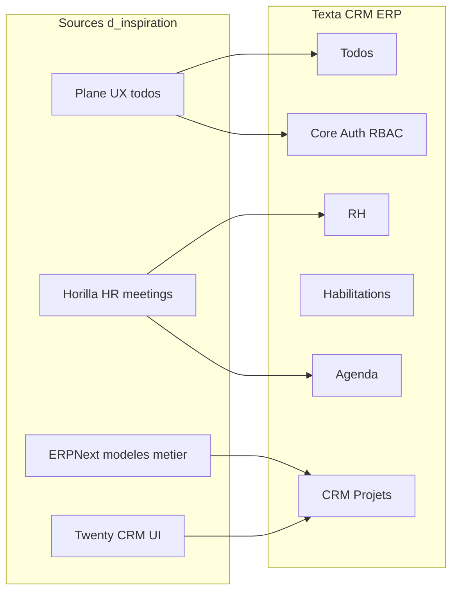
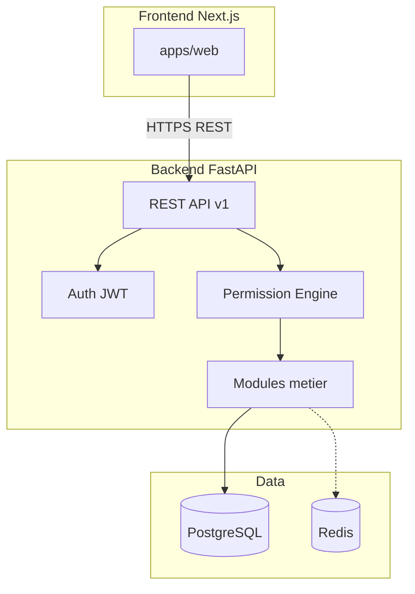

# Plateforme SaaS CRM+ERP Texta — Plan V1

## Contexte

- Workspace actuel : [vide](/Users/soufiane/Desktop/Projet%20Texta%202026/CRM) (greenfield)
- Choix validés : **développement sur mesure**, **mono-organisation en V1** (multi-tenant plus tard)

---

## Benchmarking (GitHub et écosystème)


| Projet                                                            | Stars     | Stack                 | Pertinence pour Texta           | À retenir                                  | Limites pour vous                                                                           |
| ----------------------------------------------------------------- | --------- | --------------------- | ------------------------------- | ------------------------------------------ | ------------------------------------------------------------------------------------------- |
| [Odoo](https://github.com/odoo/odoo)                              | ~43k      | Python + PostgreSQL   | ERP+CRM+HR+projets très complet | Modularité, UX mature, écosystème apps     | Monolithe énorme, licence mixte CE/Enterprise, difficile à transformer en SaaS propriétaire |
| [ERPNext](https://github.com/frappe/erpnext)                      | ~33k      | Python (Frappe) + JS  | HR, projets, CRM intégrés       | Modèle données ERP solide, HR natif        | Framework Frappe opinionated, GPLv3, personnalisation lourde                                |
| [Plane](https://github.com/makeplane/plane)                       | ~47k      | Python API + TS/React | **Todo / projets / kanban**     | UX moderne, cycles/sprints, vues multiples | AGPL, pas HR ni CRM commercial                                                              |
| [Twenty](https://github.com/twentyhq/twenty)                      | ~28k      | Node + React          | CRM moderne                     | UI SaaS-like, workflows, API-first         | BSL (restrictions SaaS commerciales), pas ERP/HR                                            |
| [Horilla HR + CRM](https://github.com/horilla-opensource/horilla) | croissant | Django 5 + Python     | **HR + CRM + meetings**         | Très proche de votre scope V1              | LGPL, monolithe Django, moins flexible pour SaaS custom                                     |
| [Django-CRM](https://github.com/DjangoCRM/Django-CRM)             | ~500      | Django                | CRM + tâches                    | Simple, 100% Python                        | Scope limité, pas ERP/HR                                                                    |
| [Frappe CRM](https://github.com/frappe/crm)                       | ~2.6k     | Frappe                | Pipeline ventes                 | Kanban leads, intégration ERPNext          | Dépendance Frappe                                                                           |


**Synthèse benchmarking :**




- **Ne pas forker** Odoo/ERPNext/Horilla : vous gardez 100% du code, licence propriétaire possible, SaaS évolutif.
- **S'inspirer** de : UX Plane (todos), modules HR/leave Horilla, modèle `Project`/`Task` ERPNext, simplicité API Twenty.

---

## Stack recommandée (Python-first, meilleur compromis SaaS)


| Couche       | Technologie                                                | Pourquoi                                           |
| ------------ | ---------------------------------------------------------- | -------------------------------------------------- |
| API          | **FastAPI** + Pydantic v2                                  | Async, OpenAPI auto, performances, écosystème SaaS |
| ORM / DB     | **SQLAlchemy 2** + **Alembic** + **PostgreSQL**            | Robuste, migrations, JSONB pour métadonnées        |
| Auth         | JWT access/refresh + **passlib/bcrypt**                    | Simple V1 ; prévoir OAuth2/Google plus tard        |
| Autorisation | **RBAC + grants projet** (ABAC léger)                      | Organigramme d'habilitation demandé                |
| Jobs async   | **Redis** + **Celery** (phase 2)                           | Notifications, emails, rappels meetings            |
| Frontend     | **Next.js 15** (App Router) + **TypeScript**               | UI SaaS moderne, SSR, routing                      |
| UI           | **shadcn/ui** + **Tailwind CSS** + **Radix**               | Composants accessibles, design cohérent            |
| Calendrier   | **FullCalendar** ou `@schedule-x/react`                    | Agenda meetings V1                                 |
| Kanban todos | **@dnd-kit**                                               | Drag-and-drop type Plane                           |
| Monorepo     | **pnpm workspaces** + **Turborepo**                        | `apps/web` + `apps/api` + `packages/shared`        |
| Qualité      | **Ruff**, **mypy**, **pytest**, **Vitest**, **pre-commit** | CI fiable                                          |
| Infra locale | **Docker Compose**                                         | Postgres + Redis + API + Web                       |


**Pourquoi pas Django seul ?** Horilla prouve que Django convient, mais FastAPI + Next.js sépare mieux API SaaS et UI riche (kanban, calendrier) tout en restant Python-centric côté métier.

---

## Architecture V1 (mono-org, multi-tenant-ready)




**Principe multi-tenant-ready sans l'activer :** chaque table métier porte `organization_id`. En V1 une seule organisation est créée au bootstrap ; le passage multi-tenant = filtrage strict + onboarding tenant.

---

## Modèle d'habilitation (organigramme délégué)

Cœur différenciant de votre produit :

1. **Rôles globaux** (organisation) : `admin`, `hr_manager`, `project_manager`, `member`
2. **Groupes** : équipes (ex. "Équipe Dev", "Compta")
3. **Grants projet** : le chef de projet accorde des permissions sur **un projet précis** à un `user` ou un `group`

```
ProjectPermissionGrant
  - project_id
  - grantee_type: user | group
  - grantee_id
  - permissions: [view, edit_tasks, manage_members, manage_settings, ...]
  - granted_by (user_id)
  - expires_at (optionnel)
```

**Règle d'évaluation** (ordre) :

1. Admin org → accès total
2. Propriétaire / chef de projet du projet → `manage_`*
3. Grant explicite (user ou via groupe) → permissions listées
4. Rôle global `member` → lecture limitée selon politique

Table `audit_log` pour chaque grant/revoke (conformité RH).

---

## Modules V1 — périmètre exact

### 1. CRM Projets

- Comptes / clients, contacts
- Projets (statut, budget, dates, responsable)
- Pipeline simple (lead → actif → terminé)
- Lien projet ↔ tâches ↔ meetings

### 2. Todo list moderne

- Tâches : statut, priorité, assigné, échéance, sous-tâches
- Vues : liste, kanban, "mes tâches"
- Filtres et recherche rapide
- Références Plane : cycles optionnels en V2

### 3. Organigramme d'habilitation

- UI : arbre org + panneau "Qui peut gérer ce projet ?"
- API : `POST /projects/{id}/grants`, `DELETE /grants/{id}`
- Matrice lecture seule des droits effectifs

### 4. Gestion RH (MVP)

- Employés, départements, postes
- Fiche employé (contrat, manager, statut)
- Demandes de congés (workflow : brouillon → soumis → approuvé/refusé)
- Organigramme RH (hiérarchie manager)

### 5. Meetings et agenda

- Événements calendrier (titre, lieu, lien visio, participants)
- Lien optionnel à un projet
- Rappels (Celery V1.1)
- Vue semaine/mois

**Hors scope V1** (phase 2+) : paie, facturation ERP, inventaire, marketing automation, intégrations Google/Microsoft Calendar.

---

## Structure du dépôt GitHub proposée

```
CRM/
├── apps/
│   ├── api/                 # FastAPI
│   │   ├── src/
│   │   │   ├── core/        # config, security, db
│   │   │   ├── modules/
│   │   │   │   ├── auth/
│   │   │   │   ├── organizations/
│   │   │   │   ├── projects/
│   │   │   │   ├── tasks/
│   │   │   │   ├── permissions/
│   │   │   │   ├── hr/
│   │   │   │   └── calendar/
│   │   │   └── main.py
│   │   └── tests/
│   └── web/                 # Next.js
│       ├── app/
│       ├── components/
│       └── lib/api/
├── packages/
│   └── shared/              # types TS, constantes permissions
├── docs/
│   ├── architecture.md
│   ├── rbac.md
│   └── api/                 # OpenAPI export
├── .cursor/
│   ├── rules/               # règles agent (voir ci-dessous)
│   └── skills/              # skills projet
├── AGENTS.md
├── docker-compose.yml
├── turbo.json
└── README.md
```

---

## Skills et règles Cursor recommandés (pour agent performant)

À créer dans le repo après validation du plan (via skill [create-rule](file:///Users/soufiane/.cursor/skills-cursor/create-rule/SKILL.md) et [create-skill](file:///Users/soufiane/.cursor/skills-cursor/create-skill/SKILL.md)) :

### Règles `.cursor/rules/` (fichiers `.mdc`)


| Fichier                | Scope                    | Contenu                                                                                                   |
| ---------------------- | ------------------------ | --------------------------------------------------------------------------------------------------------- |
| `texta-global.mdc`     | `alwaysApply: true`      | Mono-org V1, français UI, pas de commit sans demande, sécurité inputs                                     |
| `texta-api-python.mdc` | `apps/api/**/*.py`       | FastAPI patterns, SQLAlchemy 2 async, Pydantic schemas, tests pytest obligatoires sur endpoints critiques |
| `texta-web-ui.mdc`     | `apps/web/**/*.{ts,tsx}` | shadcn only, Tailwind tokens, pas de CSS inline, accessibilité                                            |
| `texta-rbac.mdc`       | `**/permissions/**`      | Toujours passer par `PermissionEngine`, jamais de check ad-hoc dans les routes                            |


### Skills projet `.cursor/skills/`


| Skill                   | Déclencheur                         | Utilité                                              |
| ----------------------- | ----------------------------------- | ---------------------------------------------------- |
| `texta-rbac-grants`     | habilitations, permissions, groupes | Modèle grants, cas limites, tests d'autorisation     |
| `texta-module-scaffold` | nouveau module métier               | Template router + service + model + migration + page |
| `texta-ui-patterns`     | kanban, calendrier, organigramme    | Composants et layouts validés                        |


### Fichier [AGENTS.md](AGENTS.md) (racine)

Instructions pour tout agent GitHub/Cursor :

- Lire `docs/architecture.md` et `docs/rbac.md` avant toute feature
- Respecter les conventions de nommage (`snake_case` API, `camelCase` TS)
- Chaque PR = 1 module, tests inclus
- Ne jamais exposer secrets ; utiliser `.env.example`
- UI en français, code en anglais

### Bonnes pratiques GitHub

- **Labels** : `module:crm`, `module:hr`, `module:rbac`, `module:calendar`, `type:feature`, `type:bug`
- **Templates** : issue feature + bug + RFC architecture
- **CI** (GitHub Actions) : lint Ruff, mypy, pytest, `pnpm lint` + `pnpm test`
- **Branches** : `main` protégée, `feat/<module>-<description>`
- **Docs API** : export OpenAPI depuis FastAPI → `docs/api/openapi.json`

---

## Phases d'implémentation

### Phase 0 — Fondations (semaine 1)

- Init monorepo, Docker Compose, PostgreSQL
- Auth (register/login/refresh), modèle User + Organization
- Layout Next.js (sidebar, auth guard)
- CI minimale

### Phase 1 — RBAC + Habilitations (semaine 2)

- Rôles, groupes, `ProjectPermissionGrant`
- `PermissionEngine` + tests unitaires exhaustifs
- Page organigramme habilitations

### Phase 2 — CRM Projets + Todos (semaines 3-4)

- CRUD projets/clients
- Tâches + kanban + liste
- Lien tâche ↔ projet

### Phase 3 — RH MVP (semaine 5)

- Employés, départements, congés
- Organigramme RH

### Phase 4 — Agenda (semaine 6)

- Calendrier meetings + participants
- Lien meeting ↔ projet

### Phase 5 — Polish V1

- Dashboard, notifications basiques, audit log UI
- Documentation utilisateur + déploiement staging

---

## Sécurité et qualité (non négociable)

- Mots de passe hashés (bcrypt), JWT courte durée + refresh rotatif
- Validation Pydantic sur toutes les entrées
- Chaque endpoint métier : `Depends(require_permission(...))`
- CORS restrictif, rate limiting sur auth (V1.1)
- Audit log immuable pour grants RH et permissions

---

## Livrables après validation du plan

1. Scaffold monorepo complet (API + Web + Docker)
2. Fichiers Cursor rules + skills + `AGENTS.md`
3. Migrations initiales et seed (1 org, admin, données démo)
4. Modules dans l'ordre des phases ci-dessus

